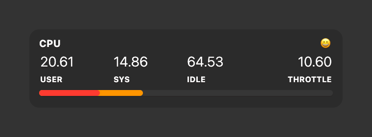

# CPU Usage

[](https://creativecommons.org/licenses/by-nc/4.0/)

A CPU usage widget for [Übersicht](http://tracesof.net/uebersicht/). It shows user, system, and idle CPU percentages with a stacked bar, plus a "throttle" readout that uses `kernel_task` CPU as a proxy for thermal/power throttling on Apple Silicon. Colors are theme-aware, with sensible built-in defaults, so the widget works on its own. Originally based on [ubersicht-cpu-bar](https://github.com/PerishableDave/ubersicht-cpu-bar).

## Screenshot



## Requirements

This widget reads CPU tick counters through a small Swift helper (`lib/cputick.swift`) rather than shelling out to slow tools. On first run, `lib/cputick.sh` compiles that helper to `lib/cputick` and reuses it afterward (rebuilding only if the source changes). Two things need to be in place:

- **Xcode Command Line Tools.** The helper is compiled with `swiftc`. If the tools are not installed, compilation fails silently and the widget shows no CPU data. Install them with:

  ```
  xcode-select --install
  ```

- **Permission to run the helper (Privacy & Security).** The first time the compiled helper runs, macOS may block it ("cputick can't be opened because Apple cannot check it for malicious software"). If that happens, open **System Settings > Privacy & Security**, scroll to the Security section, and click **Open Anyway**, then refresh Übersicht. Alternatively, clear the quarantine flag from a terminal:

  ```
  xattr -dr com.apple.quarantine cpu-usage.widget/lib
  ```

The `throttle` figure is sampled with `top`, which needs no special access. No CPU reading here requires Full Disk Access or Accessibility permissions.

## Installation

- Download the [repository](https://github.com/dionmunk/uebersicht-cpu-usage/archive/master.zip) and extract it.
- Place the `cpu-usage.widget` folder in your Übersicht extension folder.
- Refresh Übersicht.

## Theming

This widget is theme-aware. Its colors come from CSS custom properties (text, panel tint, status and series colors) with sensible built-in fallbacks, so it looks right on its own. Install the [Theme Controller](https://github.com/dionmunk/uebersicht-theme-controller) widget and this one automatically follows its color scheme and light/dark mode, staying in sync with the rest of the collection.

## License

This work is licensed under a [Creative Commons Attribution-NonCommercial 4.0 International License](https://creativecommons.org/licenses/by-nc/4.0/).
